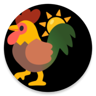

  

<h1 align="center">Rooster</h1>

**Rooster** is an Android app that helps you to rise and shine with the sun, naturally and refreshed, so you can start your day feeling your best.

## Features

- 🌅 **Wakes you up naturally**: Rise with the sun and embrace the day's potential.
- 📍 **Location-based sunrise time**: No need to manually input times. Rooster fetches sunrise times based on your location.
- 📅 **Choose your wake-up days**: Select which days of the week Rooster should work its magic.
- 🎨 **Aesthetic astral design**: Immerse yourself in a warm and inviting visual experience.
- ⏰ **Multiple Alarms**: Set multiple alarms with different modes and relative times like Dawn, Sunrise, Sunset, etc.
- 🔄 **Auto GPS Synchronization**: Your GPS coordinates are now synchronized in the background for accurate sunrise data.
- 🔄 **Auto Sun Times Synchronization**: Sun times are also updated daily in the background.

## How to use

1. 📱 Launch the Rooster app.
2. 🛰️ Update your GPS coordinates for accurate sunrise data.
3. 🗺️ Grant the app location access to provide you with tailored sunrise times.
4. 📆 Customize your wake-up schedule by choosing the days you want Rooster to activate.

## Sustainable Development Goals
> Rooster is committed to supporting the United Nations' SDG N.3

### SDG 3: Good Health and Well-Being

Rooster is aligned with the United Nations' [SDG 3: Good Health and Well-Being.](https://sdgs.un.org/goals/goal3)

The app helps people wake up at sunrise, which is the most natural and best time to wake up for your health.

Waking up at sunrise can help improve your mood, energy levels, and sleep quality.

### Benefits
- Improve your mood and energy levels.
- Get a better night's sleep.
- Boost your productivity.
- Reduce stress levels.
- Improve your overall health and well-being.

## Download
> Rooster is currently available exclusively on Android!

You can get your hands on Rooster by downloading it from this repository. Stay tuned – it's coming soon to the Play Store!

## Contributing

We welcome any contributions, suggestions or feedbacks. Don't hesitate to share your thoughts by opening an issue on our GitHub repository or by [reaching out to us directly](mailto:contact@theophile.world).

## License

Rooster is licensed under the GPLv3 License.

## Acknowledgments
Thanks to:
- All people spending their time to make a better world
- United Nations for the [SDGs](https://sdgs.un.org/goals)
